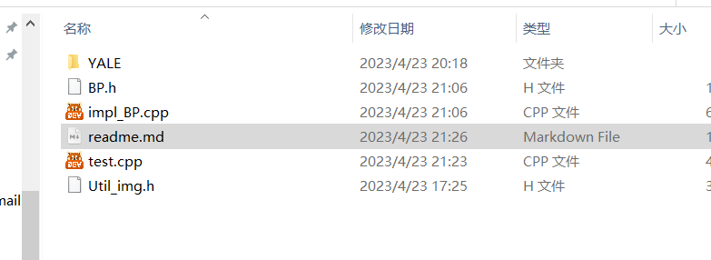
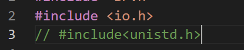
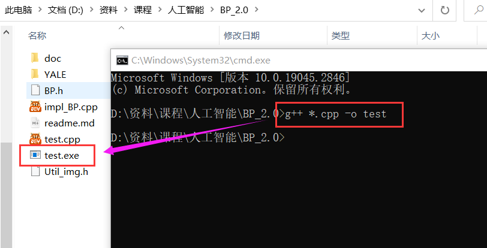
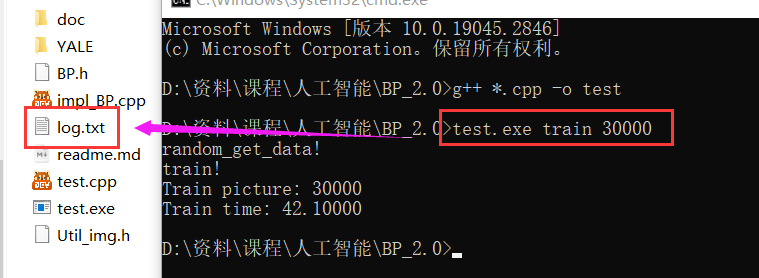
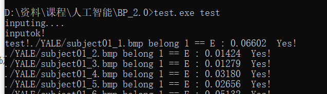
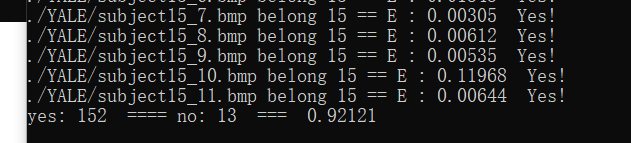

# BP 神经网络 (3层) 简单人脸识别

#### 文件结构

> BP.h 写了一些BP训练的头文件
>
> impl_BP 进行实现
>
> Util_img.h 写了一些图像处理的函数

### 使用：

#### linux注意:

需要改 impl_BP.cpp 

`#include <io.h>`  为 `#include<unistd.h>`

#### 编译： 

>  `g++ test.cpp impl_BP.cpp -o test`
>
> or
>
> `g++ *.cpp -o test`
>
> 
>
> 

#### 运行

#### Win CMD 运行

`test.exe train` 进行训练，默认训练30000次，正确率大概在92%左右 ，会产生log.txt 文件，用来储存参数

`test.exe train n` 进行训练，训练 n 次。

`test.exe test`  or `test.exe` 进行测试。

#### linux bash 运行

`./test train` 进行训练，默认训练30000次，正确率大概在92%左右

`./test train n` 进行训练，训练 n 次。

`./test test`  进行测试。

训练截图如上。

### 原理：

感谢 Cylix  [cylix-lee (Cylix) (github.com)](https://github.com/cylix-lee) 指导

BP 神经网络不讲原理，仅讲模型转换。

对于一幅全色图，将像素点看成向量，在训练的图中，每张图共计 8000 个像素，范围在 0 到 255 之间，可以看成 长度为 8000 的向量。

共计15个人像，对于目标向量，长度为 15，采用 one hot编码，如果当前图片属于第3个人，那么目标向量为 (0,0,1,0,0,0,0,0,0,0,0....0);

然后进行BP训练即可。

BP训练过程，对着指导文档写大模拟即可。

在 `BP.h` 中有注释

#### 其他

本BP网络的规模为 (500 - 500 - 15)

对初始图像进行了平均池化，原图像为 80 * 100 ，压缩后图像为 20 * 25

对所有的动态学习率，均给定值为 ：Subalgha

变量命名与指导文档对应。

δ 对应 delta_y

δ* 对应 delta_h